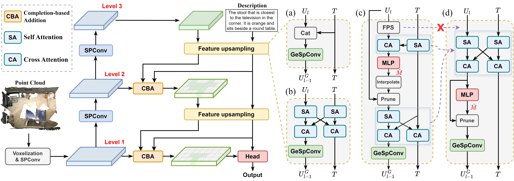
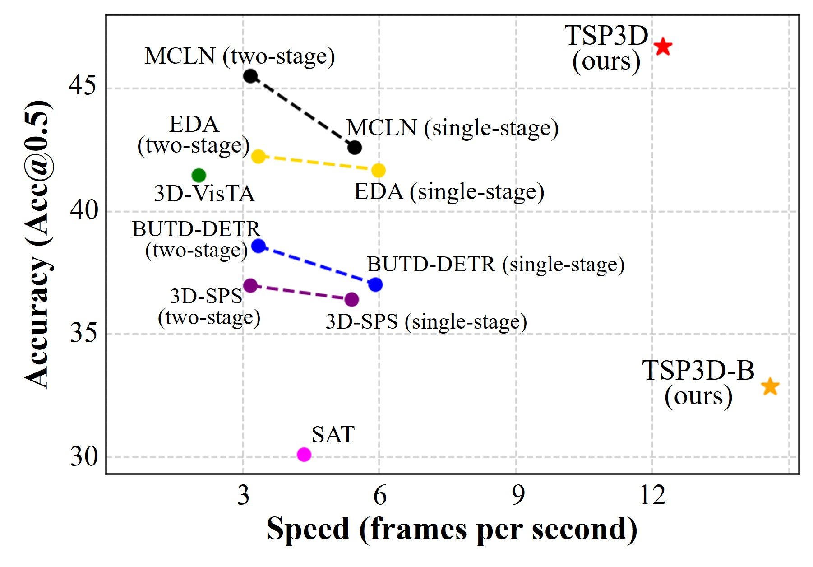
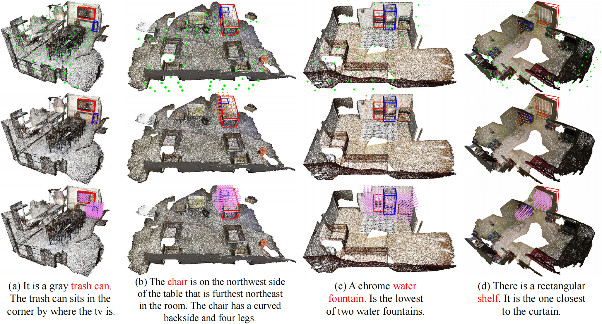
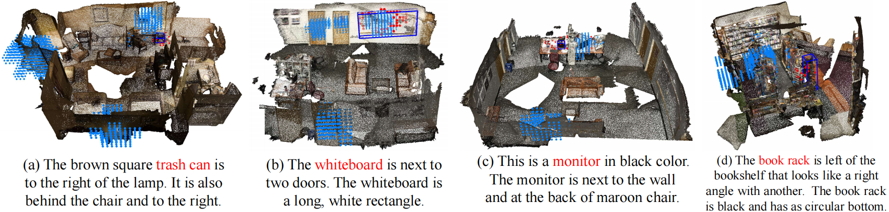

# TSP3D: Text-guided Sparse Voxel Pruning for Efficient 3D Visual Grounding

This repo contains the official PyTorch implementation for paper [Text-guided Sparse Voxel Pruning for Efficient 3D Visual Grounding](https://arxiv.org/abs/2502.10392).

> Text-guided Sparse Voxel Pruning for Efficient 3D Visual Grounding  
> [Wenxuan Guo](https://github.com/GWxuan)*, [Xiuwei Xu](https://xuxw98.github.io/)\*, [Ziwei Wang](https://ziweiwangthu.github.io/), [Jianjiang Feng](https://ivg.au.tsinghua.edu.cn/~jfeng/index.html)$^\dagger$, [Jie Zhou](https://scholar.google.com/citations?user=6a79aPwAAAAJ&hl=en&authuser=1), [Jiwen Lu](http://ivg.au.tsinghua.edu.cn/Jiwen_Lu/)

\* Equal contribution $\dagger$ Corresponding author

In this work, we propose an efficient multi-level convolution architecture for <b>3D visual grounding</b>. TSP3D achieves superior performance compared to previous approaches in both <b>inference speed and accuracy</b>.

## News
- [2025/2/27]: TSP3D is accepted to CVPR25 with final reviews of all accepts (the highest ratings)!!
- [2025/2/16]: Code and arxiv paper released.

## Method
Method Pipeline:
<figure>
<p align="center" >

</p>
</figure>

## Getting Started
### 1. Installation

+ **(1)** Install environment with `environment.yml` file:
  ```
  conda env create -f environment.yml --name TSP3D
  ```
  + or you can install manually:
    ```
    conda create -n TSP3D python=3.9
    conda activate TSP3D
    conda install pytorch==1.9.0 torchvision==0.10.0 cudatoolkit=11.1 -c pytorch -c nvidia
    pip install numpy ipython psutil traitlets transformers termcolor ipdb scipy tensorboardX h5py wandb plyfile tabulate
    ```
+ **(2)** Install spacy for text parsing
  ```
  pip install spacy
  # 3.3.0
  pip install https://github.com/explosion/spacy-models/releases/download/en_core_web_sm-3.3.0/en_core_web_sm-3.3.0.tar.gz
  ```

+ **(3)** Follow [mmdetection3d](https://github.com/open-mmlab/mmdetection3d/blob/main/docs/en/get_started.md) to install mmcv, mmdet and mmdet3d.

+ **(4)** Install MinkowskiEngine.
  ```shell
  conda install openblas-devel -c anaconda
  pip install -U git+https://github.com/NVIDIA/MinkowskiEngine -v --no-deps --install-option="--blas_include_dirs=/opt/conda/include" --install-option="--blas=openblas"
  ```

### 2. Data preparation

The final required files are as follows:
```
├── [DATA_ROOT]
│	├── [1] train_v3scans.pkl # Packaged ScanNet training set
│	├── [2] val_v3scans.pkl   # Packaged ScanNet validation set
│	├── [3] ScanRefer/        # ScanRefer utterance data
│	│	│	├── ScanRefer_filtered_train.json
│	│	│	├── ScanRefer_filtered_val.json
│	│	│	└── ...
│	├── [4] ReferIt3D/        # NR3D/SR3D utterance data
│	│	│	├── nr3d.csv
│	│	│	├── sr3d.csv
│	│	│	└── ...
│	├── [5] roberta-base/     # roberta pretrained language model
│	├── [6] checkpoints/      # We will release the trained models
```

+ **[1] [2] Prepare ScanNet Point Clouds Data**
  + **1)** Download ScanNet v2 data. Follow the [ScanNet instructions](https://github.com/ScanNet/ScanNet) to apply for dataset permission, and you will get the official download script `download-scannet.py`. Then use the following command to download the necessary files:
    ```
    python2 download-scannet.py -o [SCANNET_PATH] --type _vh_clean_2.ply
    python2 download-scannet.py -o [SCANNET_PATH] --type _vh_clean_2.labels.ply
    python2 download-scannet.py -o [SCANNET_PATH] --type .aggregation.json
    python2 download-scannet.py -o [SCANNET_PATH] --type _vh_clean_2.0.010000.segs.json
    python2 download-scannet.py -o [SCANNET_PATH] --type .txt
    ```
    where `[SCANNET_PATH]` is the output folder. The scannet dataset structure should look like below:
    ```
    ├── [SCANNET_PATH]
    │   ├── scans
    │   │   ├── scene0000_00
    │   │   │   ├── scene0000_00.txt
    │   │   │   ├── scene0000_00.aggregation.json
    │   │   │   ├── scene0000_00_vh_clean_2.ply
    │   │   │   ├── scene0000_00_vh_clean_2.labels.ply
    │   │   │   ├── scene0000_00_vh_clean_2.0.010000.segs.json
    │   │   ├── scene.......
    ```
  + **2)** Package the above files into two .pkl files(`train_v3scans.pkl` and `val_v3scans.pkl`):
    ```
    python Pack_scan_files.py --scannet_data [SCANNET_PATH] --data_root [DATA_ROOT]
    ```
+ **[3] ScanRefer**: Download ScanRefer annotations following the instructions [HERE](https://github.com/daveredrum/ScanRefer). Unzip inside `[DATA_ROOT]`.
+ **[4] ReferIt3D**: Download ReferIt3D annotations following the instructions [HERE](https://github.com/referit3d/referit3d). Unzip inside `[DATA_ROOT]`.
+ **[5] roberta-base**: Download the roberta pytorch model:
  ```
  cd [DATA_ROOT]
  git clone https://huggingface.co/roberta-base
  cd roberta-base
  rm -rf pytorch_model.bin
  wget https://huggingface.co/roberta-base/resolve/main/pytorch_model.bin
  ```


### 3. Training

+ Please specify the paths of `--data_root`, `--log_dir` in the `train_*.sh` script first.
+ For **ScanRefer** training
  ```
  sh scripts/train_scanrefer_single.sh
  ```
+ For **SR3D** training
  ```
  sh scripts/train_sr3d.sh
  ```
+ For **NR3D** training
  ```
  sh scripts/train_nr3d.sh
  ```

### 4. Evaluation

+ Please specify the paths of `--data_root`, `--log_dir`, `--checkpoint_path` in the `test_*.sh` script first. When evaluating inference speed, please use a batch size of 1 and a single GPU.
+ For **ScanRefer** evaluation
  ```
  sh scripts/test_scanrefer_single.sh
  ```
+ For **ScanRefer** evaluation
  ```
  sh scripts/test_scanrefer_single.sh
  ```
+ For **SR3D** evaluation
  ```
  sh scripts/test_sr3d.sh
  ```
+ For **NR3D** evaluation
  ```
  sh scripts/test_nr3d.sh
  ```

## Main Results
+ We provide the checkpoints for quick reproduction of the results reported in the paper.
  Benchmark | Pipeline | Acc@0.25 | Acc@0.5 | Inference Speed (FPS) | Downloads |
  :----: | :----: | :----: | :----: | :----: | :----: |
  ScanRefer | Single-stage | 56.45 | 46.71 | 12.43 | [model](https://cloud.tsinghua.edu.cn/f/f277c88df4ba4ffa9398/?dl=1)

  Benchmark | Pipeline | Acc@0.25 | Acc@0.5 | Downloads |
  :----: | :----: | :----: | :----: | :----: |
  Nr3d | Single-stage | 48.7 | 37.0 | [model](https://cloud.tsinghua.edu.cn/f/bc5b3b89dbd4464ba86b/?dl=1)
  Sr3d | Single-stage | 57.1 | 44.1 | [model](https://cloud.tsinghua.edu.cn/f/3e2b76bba9304896a802/?dl=1)

+ Comparison of 3DVG methods on ScanRefer dataset:
<figure>
<p align="left" >

</p>
</figure>

## Visualization
+ Visualization of the text-guided pruning process:

<figure>
<p align="center" >

</p>
</figure>

+ Visualization of the completion-based addition process:

<figure>
<p align="center" >

</p>
</figure>

## Acknowledgements

We are quite grateful for [DSPDet3D](https://github.com/xuxw98/DSPDet3D), [BUTD-DETR](https://github.com/nickgkan/butd_detr), [EDA](https://github.com/yanmin-wu/EDA), [ScanRefer](https://github.com/daveredrum/ScanRefer) and [TR3D](https://github.com/SamsungLabs/tr3d).


## Citation
```
@article{guo2025tsp3d, 
      title={Text-guided Sparse Voxel Pruning for Efficient 3D Visual Grounding}, 
      author={Wenxuan Guo and Xiuwei Xu and Ziwei Wang and Jianjiang Feng and Jie Zhou and Jiwen Lu},
      journal={arXiv preprint arXiv:2502.10392},
      year={2025}
}
```
